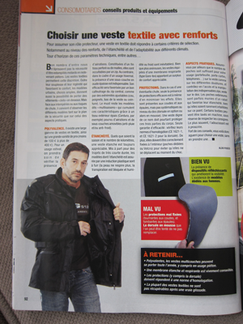
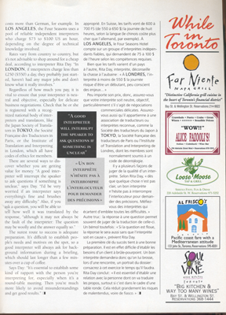
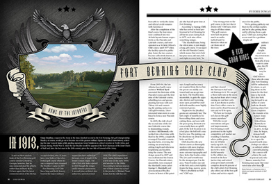
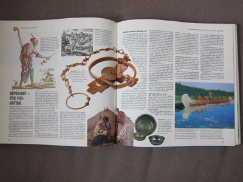
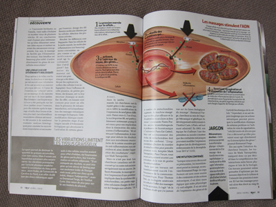

### Use Cases from Print Layouts for Exclusions and Shapes

#### Shapes


Here there's a circle shape affecting the flow of two columns. This could be done as a float with a shape (with the addition of a float-offset property), as an absolutely positioned exclusion, or with grid positioning placing an exclusion over a multicol element or pair of regions. You can see a markup example of a reconstruction of that use case [here](http://disruptive-innovations.com/zoo/customers/Adobe/FFMC.html). Below is a screenshot of that reconstruction in a browser and the second code block is the CSS code used to create the exclusion. The first code block uses a much simpler mechanism from GCPM.

```css
#exclusion {
  float: top right;
  float-offset: -50% 50%;
  shape-outside: url(motorbike.png);
}
```

```css
#lipsum {
  position: relative;
}
 
#exclusion {
  position: absolute;
  top: -webkit-calc(50% - 67px);
  left: -webkit-calc(50% - 67px);
  -webkit-wrap-flow: both;
  -webkit-shape-outside: url(motorbike.png);
}
```



This layout has many interesting possible expressions in CSS:

1.  A background with a shape
    1.  pulled from image data
    2.  extracted from content edges
    3.  defined in a path
2.  A bottom-positioned float with a shape
3.  One or more exclusions outside the text flow

You can see a markup example of a reconstruction of that use case [here](http://disruptive-innovations.com/zoo/customers/Adobe/Veste.html). Below is a screenshot of that reconstruction in a browser:

#### Pull Quotes



These pull quotes are from separate flows - the top from the left-side English translation and the bottom from the right-side French translation. While there might be some combination of new float positioning properties that could achieve this effect, two absolutely positioned exclusions is likely to be the simpler design to execute. Given an appropriate containing block for the flows, the pull-quotes as exclusions could be positioned like this:

```css
.top-pull {
  position:absolute;
  right: 45%;
  bottom: 50%;
  max-width:15%;
  wrap-flow:both;
}
.bottom-pull {
  position:absolute;
  top: 50%;
  left: 45%;
  max-width:15%;
  wrap-flow:both;
}
```

#### Background Exclusion



The ribbon and star are part of the overall page design - more of a title than anything else. This could be done either as a background or an absolutely positioned exclusion.

#### Complex Exclusion Interacting with Multiple Flows



The trap in the middle uses multiple shapes to affect the wrap of text around the image and enclose the caption inside. Note that it overlaps the image to its top left and does not use a content edge shape on the bottom left.



Here the large oval wraps the article text and the text of its top two captions, but the remaining captions are not affected by the shape.

More examples collected at the top of this blog post: <http://galjot.si/css-exclusions>