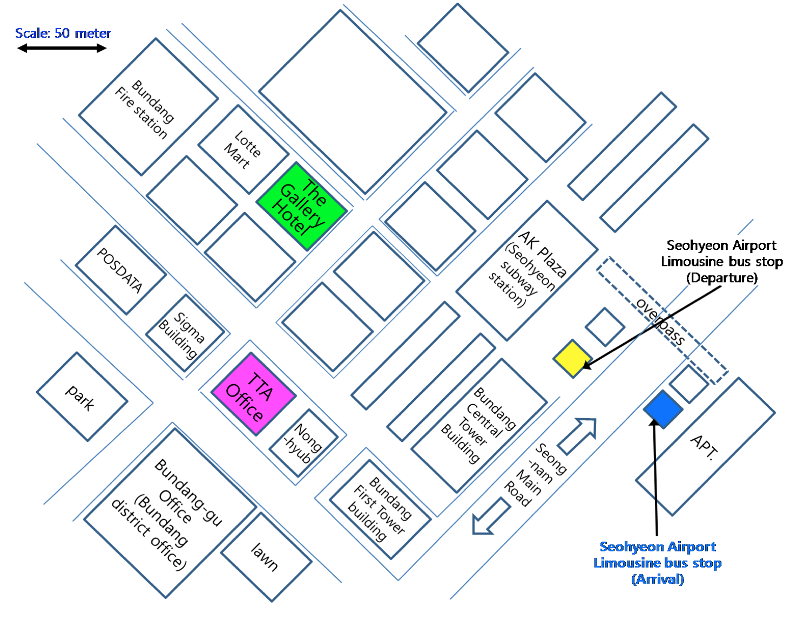
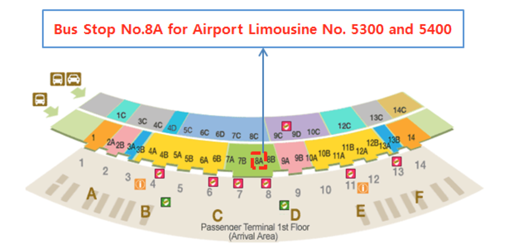
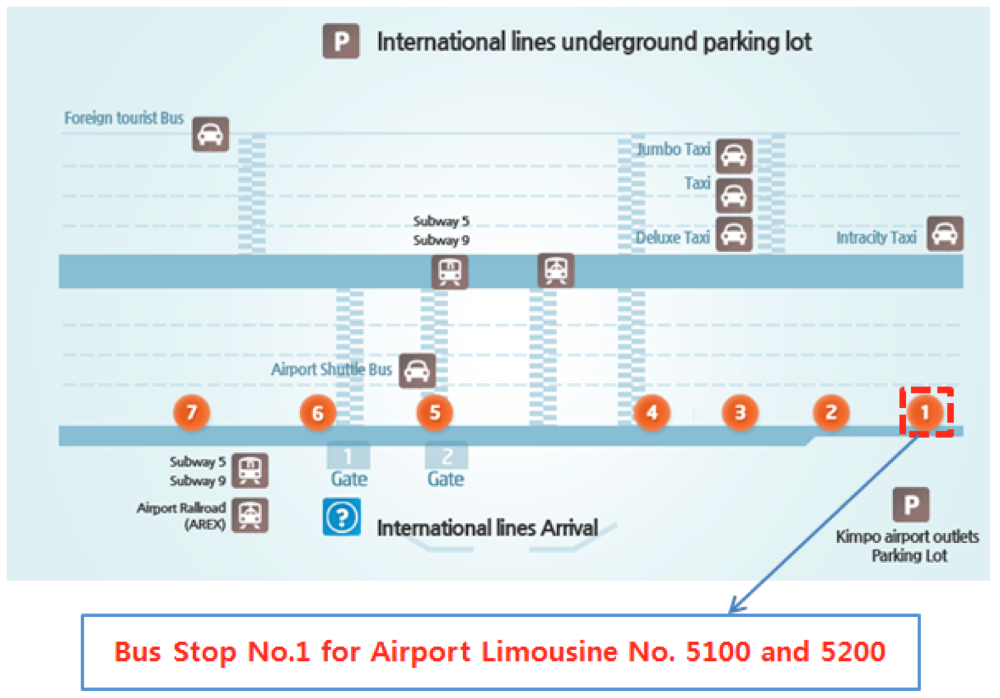
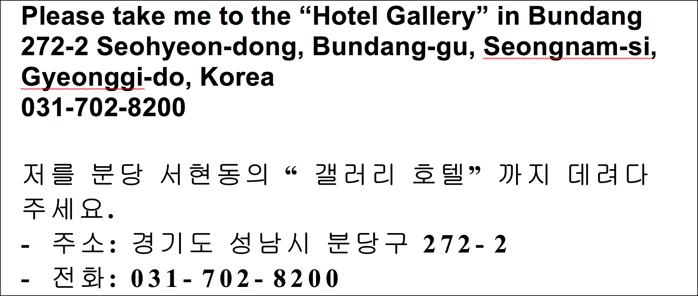

# Seoul F2F 2014

**Dates**: 2014 May 19-21, **we start every day at 9am so be in the room before 9am please**.

Host: [Samsung Electronics](http://www.samsung.com/), [TTA](http://www.tta.or.kr/) (Telecommunications Technology Association), [ETRI](http://www.etri.re.kr/eng/) (Electronics and Telecommunications Research Institute) and the [W3C Korean Office](http://www.w3c.or.kr/)

Organizer: Daniel Glazman, Samsung Research America, Open Source Group

See also the Korean Meetup, TTWF and WWW 2014 events at the bottom of this page.

## Meeting Minutes

**Monday, 19 May:**

- [Part I](http://lists.w3.org/Archives/Public/www-style/2014Jun/0056.html), Flexbox
- [Part II](http://lists.w3.org/Archives/Public/www-style/2014Jun/0057.html), Transitions and Animations, calc()
- [Part III](http://lists.w3.org/Archives/Public/www-style/2014Jun/0058.html), Image Values 3
- [Part IV](http://lists.w3.org/Archives/Public/www-style/2014Jun/0059.html), Values and Units
- [Part V](http://lists.w3.org/Archives/Public/www-style/2014Jun/0060.html), Counter Styles, CSS Formatting for Books, Font Load Events, Future F2F Meetings, CSS Syntax - Unpaired Surrogates, MQ Listener

**Tuesday, 20 May:**

- [Part I](http://lists.w3.org/Archives/Public/www-style/2014Jun/0106.html), Footnotes in GCPM, CSS Scoping
- [Part II](http://lists.w3.org/Archives/Public/www-style/2014Jun/0107.html), Flexbox, CSSOM and CSSOM View
- [Part III](http://lists.w3.org/Archives/Public/www-style/2014Jun/0108.html), CSS Line Layout
- [Part IV](http://lists.w3.org/Archives/Public/www-style/2014Jun/0109.html), Box Alignment, Box Model/Render Tree, -webkit-line-clamp

**Wednesday, 21 May:**

- [Part I](http://lists.w3.org/Archives/Public/www-style/2014Jun/0165.html), CSS Masking, Geometry Interfaces, Test Results Script, Selectors 4
- [Part II](http://lists.w3.org/Archives/Public/www-style/2014Jun/0166.html), text-overflow: fade, Logical Properties, background-position -x/-y
- [Part III](http://lists.w3.org/Archives/Public/www-style/2014Jun/0167.html), CSS3 Text
- [Part IV](http://lists.w3.org/Archives/Public/www-style/2014Jun/0168.html), web-platform-tests and csswg-test github, annotate url() with “crossorigin” “integrty” etc.
- [Part V](http://lists.w3.org/Archives/Public/www-style/2014Jun/0169.html), Grid/Subgrid, position: sticky, Acknowledgements

## Arrival in Korea

**IMPORTANT WARNING**: Korean immigration rules require your passport to be valid at least 6 months after return date. Entry in Korea can be refused if you're not meeting this requirement.

Use [this link](http://www.hikorea.go.kr/pt/InfoDetailR_en.pt?categoryId=2&parentId=385&catSeq=401&showMenuId=375) to check if you need a visa. Visiting EU, US and Canada nationals usually don't need a visa for stays under 3 months.

## Location

[TTA Office, 267-2 Seohyeon-dong, Bundang-gu, Seongnam-city, Gyeonggi-do, 463-824, KOREA](https://maps.google.fr/maps?q=%EB%8C%80%ED%95%9C%EB%AF%BC%EA%B5%AD+%EA%B2%BD%EA%B8%B0%EB%8F%84+%EC%84%B1%EB%82%A8%EC%8B%9C+%EB%B6%84%EB%8B%B9%EA%B5%AC+%EC%84%9C%ED%98%84%EB%8F%99+267-2&hl=fr&ie=UTF8&sll=37.403983,127.080574&sspn=0.205635,0.318947&geocode=FUJ0OgIdsLaTByljavRRA1h7NTERrnXCla0iGA%3BFUJ0OgIdsLaTByERrnXCla0iGCljavRRA1h7NTERrnXCla0iGA&hnear=267-2+Seohyeon-dong,+Bundang-gu,+Seongnam-si,+Gyeonggi-do,+Cor%C3%A9e+du+Sud+(47+Bundang-ro)&t=m&start=0&z=15)

**Meeting room:** TBD; WiFi connectivity only, no wires.

**Dial-in info:** TBD

**Parking:** TBD if needed

Weather Forecast: [May 2014 in Seoul](http://www.accuweather.com/en/kr/seoul/226081/may-weather/226081)

Electricity in Korea: 220 volts 60 Hz. [Plug type F](http://en.wikipedia.org/wiki/AC_power_plugs_and_sockets#CEE_7.2F4_.28German_.22Schuko.22.29.28Type_F.29). Make sure to bring your adapter if you need one.

## Participants

(Alphabetical by full name.)

| Name | Representing | Arrive | Leave | Hotel | Flight Info | Notes |
|----|----|----|----|----|----|----|
| Adenilson Cavalcanti | Samsung | 18-May | 24-May | Shilla Stay | OZ211 |  |
| Alan Stearns | Adobe | 18-May | 23-May | Hotel Gallery |  |  |
| Bruno Abinader | Samsung | 18-May | 24-May | Shilla Stay | OZ211 |  |
| Chris Lilley | W3C | 18-May | 23-May | Hotel Gallery | BA 17 arr 07:30 / BA 18 dep 10:30 |  |
| Daniel Glazman | Samsung | 17-may | 23-may | Hotel Gallery | AF264 07:35 / AF267 09:30 | Spicy food forbidden |
| Dael Jackson | Invited Expert | 18-May | 25-May | Hotel Gallery | BA 17 7:30 / BA 18 10:35 | vegetarian |
| Dave Cramer | Hachette | 18-May | 23-May | Hotel Gallery | UA79 21:35 / UA892 17:00 |  |
| Dongwoo Joshua Im | Samsung |  |  | Living in Korea |  |  |
| Edward O'Connor | Apple | 18 May | 24 May | Hotel Gallery | UA893 / UA892 |  |
| fantasai | Invited Expert | 17 May | 25 May | Hotel Gallery | OZ211 / TG 659 | flights as yet unconfirmed |
| Glenn Adams | CoxCom | 17-May | 22-May | Hotel Gallery | AC63 / AC64 |  |
| Jet Villegas | Mozilla | 18-may | 22-may | Hotel Gallery |  |  |
| Koji Ishii | Invited Expert | 18-May | 22-May | ? | OZ1035 / OZ1065 |  |
| L. David Baron | Mozilla | in advance | 22-may | Hotel Gallery | SQ15 / SQ16 | at Hotel Gallery from 18 May |
| Peter Linss | HP | 17-may | 25-may | Hotel Gallery | UA 893 15:03 / UA 892 17:00 |  |
| Philippe Le Hegaret | W3C | 18-may | 22-may | Hotel Gallery | UA 893 15:03 / CA 126 17:50 |  |
| Simon Pieters | Opera Software | 18-may | 22-may | Hotel Gallery | CA 131 14:15 / CA 138 09:25 |  |
| Shane Stephens | Google | 18-may | 22-may | ? | AY 0041 08:20 / JL 0945 14:00 |  |
| Shinyu Murakami | Antenna House | 18-May | 22-May | Hotel Gallery | JL93 17:55 / JL94 19:15 | pescaterian |
| Sylvain Galineau | Adobe | 16-may | 23-may | Hotel Gallery | OZ 271 17:50 / OZ 272 18:40 |  |
| Rossen Atanassov | Microsoft | 16-may | 22-may | Hotel Gallery |  | pescaterian |
| Tab Atkins | Google | 18-May | 22-May | Hotel Gallery | KE 934 15:10 / KE 23 17:30 |  |
| Andrey Rybka | Bloomberg | 17-May | 23-May | Hotel Gallery | Asiana 366/AA280 | cannot eat pork |
| Shinsuke Matsuki | ACCESS | 19-May | 21-May | Hotel Gallery |  |  |

Regrets:

- Anton Prowse
- Lea Verou
- Simon Sapin
- Liam Quin (maybe by telephone though)
- Steve Zilles
- Dirk Schulze

## Housing

We have negotiated hotel rooms at reduced price at Hotel Gallery, 150 meters away from the meeting venue.The Hotel Gallery is the only luxury business hotel in Seongnam-City, Seoul’s largest commuting satellite city. It is located in the central downtown of Bundang-gu which is the most thriving area of Seongnam City. The area can be connected in 30 minutes from big cities around Seoul, such as Suwon and Anyang.

**We recommend you book your hotel room as soon as possible because we won't be able to keep these rooms for very long.** Reservation **must** be done using [this form (docx format)](/_media/planning/seoul2014-hotel-reservation-form.docx). It can be sent by email or fax. Please ping Daniel if you have any issue with the hotel using this form.

Warning: the limousine bus mentioned on the reservation form is for people landing in Seohyeon Domestic Airport. If you arrive from abroad, you'll land in Incheon International Airport or Gimpo International Airport…

- [The Hotel Gallery](http://www.galleryhotel.co.kr/english)
  - [272-2 Seohyeon-dong, Bundang-gu, Seongnam-City, Gyeonggi-do, Korea](https://maps.google.fr/maps?q=%EB%8C%80%ED%95%9C%EB%AF%BC%EA%B5%AD+%EA%B2%BD%EA%B8%B0%EB%8F%84+%EC%84%B1%EB%82%A8%EC%8B%9C+%EB%B6%84%EB%8B%B9%EA%B5%AC+%EC%84%9C%ED%98%84%EB%8F%99+272-2&hl=fr&ie=UTF8&ll=37.385265,127.121043&spn=0.025711,0.053172&sll=37.383752,127.120571&sspn=0.025711,0.053172&hnear=272-2+Seohyeon-dong,+Bundang-gu,+Seongnam-si,+Gyeonggi-do,+Cor%C3%A9e+du+Sud+(321+Hwangsaeul-ro)&t=m&z=15)
  - Phone: +82-31-702-8200
  - Fax: +82-31-707-6776
  - Standard room, breakfast included (double bed, wired high speed internet and VAT): KRW 162,800 per night (at today's rate that's roughly \$151 or 112€)
  - Same without breakfast: KRW 143,000 (\$133 or 98€)

Click on the map of the hotel/venue area below to see a larger version of it:

## Transport to/from Airport

It takes between 60 to 80 minutes (yes…) from Incheon or Gimpo International Airports to the Hotel Gallery by Airport Limousine Bus. Expect an hour if you take a taxi. VISA cards are accepted just everywhere, you don't have to care about having korean money with you.

- By Airport Limousine Bus
  - At Incheon International Airport Gate 8A (1st floor) Bus Stop Station, Limousine bus No.5300 and 5400 runs to Seohyeon Bus Station, the first stop, every 20/30 minutes from 05:20 to 22:40. It costs KRW 12,000 one way.
    - [Detailed information on Limousine bus No. 5300](http://www.airport.kr/airport/traffic/bus/busView.iia?seq=103&flag=E)
    - [Detailed information on Limousine bus No. 5400](http://www.airport.kr/airport/traffic/bus/busView.iia?seq=102&flag=E)
    - Incheon Airport map with exit for Airport Limo Buses: 
  - At Gimpo International Airport Gate 1 Bus Stop Station, Limousine bus No. 5100 and 5200 runs to Seohyeon Station, the first stop, every 30 minutes from 06:00 to 22:00. It costs KRW 6000.
    - [Detailed information on Limousine bus No. 5100](http://www.airport.co.kr/mbs/gimpoeng/jsp/bus/busView.jsp?id=gimpoeng_030101010000&categoryId=11275&busIdx=177631)
    - [Detailed information on Limousine bus No. 5200](http://www.airport.co.kr/mbs/gimpoeng/jsp/bus/busView.jsp?id=gimpoeng_030101010000&categoryId=11275&busIdx=177532)
    - Gimpo Airport map with exit for Airport Limo Buses: 
- By Taxi
  - Taxi is always available from the Incheon International Airport, whose fare (one way) will be approximately KRW 120,000~140,000 for deluxe taxi and KRW 80,000~100,000 for normal taxi( tall gate fee will be added). Again, all taxis accept VISA for payment.
  - Taxi fare (one way) from the Gimpo International Airport will be approximately KRW 100,000 for deluxe taxi and KRW 60,000~80,000 for normal taxi (tall gate fee will be added).
  - Taxi fares are of course subject to traffic condition…
  - Here is something you can print and show to the taxi driver…
  - 

## Travel to/from Hotel/TTA Office

The venue is at walking distance (150 meters) from the hotel. Please see the map above in the Housing section.

## Group dinner

- tuesday night, sponsored by ETRI. To be announced.

## Agenda

### Monday

#### AM

- Flexbox LC → CR
- CSS Transitions and CSS Animations status
  - More discussion of T/A cascading behavior, weighing impl difficulty against user usefulness
- CSS Animations: OM issues. More if time permits.
- Calc
- Image Values 3
  - Dropping features from image()

#### PM

- Image Values 3 (cont'd)
  - Deprecating/dropping image-orientation
  - [2-value image-resolution](http://lists.w3.org/Archives/Public/www-style/2013Jul/0568.html)
- Values and Units L3
  - custom-ident rules
  - optional ordered combinator
  - publish update
- Counter Styles
  - Review changes
    - [Allow reading out counter styles, somehow](http://lists.w3.org/Archives/Public/www-style/2014May/0146.html)
    - [How to do padding between counter and list item](http://lists.w3.org/Archives/Public/www-style/2014Apr/0434.html)
    - [Which applies first - pad or negative?](http://lists.w3.org/Archives/Public/www-style/2014Apr/0400.html)
  - Align with decision on custom-ident rules
- CSS3 for formatting books
- font load events to LC
- September f2f location / dates
- CSS Syntax - unpaired surrogates
- MediaQueryListener - decide to switch to events

### Tuesday

#### AM

- Footnotes in GCPM \[would like to attend remotely - Liam\]
- CSS Scoping
- CSS Flexbox to PR (last call ended, CR exit criteria met)
- CSS Object Model

#### PM

- CSS Line Layout
  - SVG spec (a REC) defines most properties already. SVG WG would like to reference CSS Line Layout instead. Since there hasn't been progress for two years, how should SVG WG proceed?
  - Specify heuristics for fonts/font systems without enough font metric information.
  - [Initial caps](http://dauwhe.github.io/dropcaps/Overview.html) \[would like to participate remotely - Liam\]
- Box Alignment
  - review next baseline-alignment section
  - publish update
- Box model / Render tree *\[Interested in calling in. Bert\]*
- `'-webkit-line-clamp`'
  - cool ability, let's talk about how to do it right and figure out where to spec it (Line Layout?)

### Wednesday

#### AM

- CSS Masking
- Geometry Interfaces
  - Should unit-less values (like for SVG transform presentation attribute) be allowed as string input for the constructor too?
  - FPWD
- Test results script hosted on w3.org for /TR publications
- Selectors4 to LC

#### PM

- CSS3 Text *\[Is it possible to phone in? If so, please, late in the afternoon. Bert\]*
  - [text-align shorthanding](http://dev.w3.org/csswg/css-text-3/issues-lc-2013#issue-24)
  - grapheme cluster terminology
  - Defining 'text-justify: auto' \[can phone in for this? - Liam\]
  - [Arabic letters connecting between elements with display: inline](http://dev.w3.org/csswg/css-text-3/issues-lc-2013#issue-70)
  - [Control characters](http://dev.w3.org/csswg/css-text-3/issues-lc-2013#issue-72)
- Split CSS Text 3
- web-platform-tests and csswg-test github repositories
- Ability to annotate url() with “crossorigin”, “integrity”, etc for @import, background-image etc.
  - [crossorigin thread](http://lists.w3.org/Archives/Public/public-fx/2013AprJun/thread.html#msg176)
  - [Integrity spec](http://w3c.github.io/webappsec/specs/subresourceintegrity/)
- subgrid
- position: sticky
- [CSS conditions](http://www.w3.org/2014/05/css-conditions.html)

## Proposed topics for the meeting

- CSS Scoping
- `'-webkit-line-clamp`'
  - cool ability, let's talk about how to do it right and figure out where to spec it (Line Layout?)
- MediaQueryListener - decide to switch to events
- Image Values 3
  - Dropping features from image()
  - Deprecating/dropping image-orientation
  - 2-value image-resolution
- Counter Styles
  - Review changes
  - Align with decision on custom-ident rules
- Selectors4 to LC
- Flexbox LC → CR
- Values and Units L3
  - custom-ident rules
  - optional ordered combinator
  - publish update
- Box Alignment
  - review next baseline-alignment section
  - publish update
- CSS3 Text *\[Is it possible to phone in? If so, please, late in the afternoon. Bert\]*
  - [text-align shorthanding](http://dev.w3.org/csswg/css-text-3/issues-lc-2013#issue-24)
  - grapheme cluster terminology
  - Defining 'text-justify: auto' \[can phone in for this? - Liam\]
  - [Arabic letters connecting between elements with display: inline](http://dev.w3.org/csswg/css-text-3/issues-lc-2013#issue-70)
  - [Control characters](http://dev.w3.org/csswg/css-text-3/issues-lc-2013#issue-72)
- Split CSS Text 3
- CSS Masking
- Box model / Render tree *\[Interested in calling in. Bert\]*
- September f2f location / dates
- Geometry Interfaces
  - Should unit-less values (like for SVG transform presentation attribute) be allowed as string input for the constructor too?
  - FPWD
- CSS Line Layout
  - SVG spec (a REC) defines most properties already. SVG WG would like to reference CSS Line Layout instead. Since there hasn't been progress for two years, how should SVG WG proceed?
  - Specify heuristics for fonts/font systems without enough font metric information.
  - Initial caps \[would like to participate remotely - Liam\]
- CSS Transitions and CSS Animations status
  - More discussion of T/A cascading behavior, weighing impl difficulty against user usefulness
- Footnotes in GCPM \[would like to attend remotely - Liam\]
- font load events to LC
- Test results script hosted on w3.org for /TR publications
- CSS Animations: OM issues. More if time permits.
- CSS3 for formatting books
- CSS Object Model

## May-22 Workshop

We will also have a Workshop/Meetup with the Korean industry on the 22nd of May, morning, organized by the Korean Governmental Telecommunications Office. They're interested in discussions with the CSS WG about our future work and the future of the Web. Please add your name below if you plan to attend and/or speak:

| Name | Can speak? | Proposed topic |
|----|----|----|
| Alan Stearns | if needed |  |
| Daniel Glazman | yes | W3C, the CSS WG and our current work |
| Dave Cramer | if needed | print publishing with HTML and CSS |
| Dongwoo Joshua Im |  |  |
| Philippe Le Hegaret | yes | W3C, etc. |
| Shinyu Murakami | if needed |  |

## TTWF

There will be a Test The Web Forward event in Seoul April 11 and 12. See the details [here](http://testthewebforward.org/events/2014/seoul.html).

## WWW 2014

The 2014 Web Conference will be in Seoul 7-11 Apr. See details [here](http://www2014.kr/).