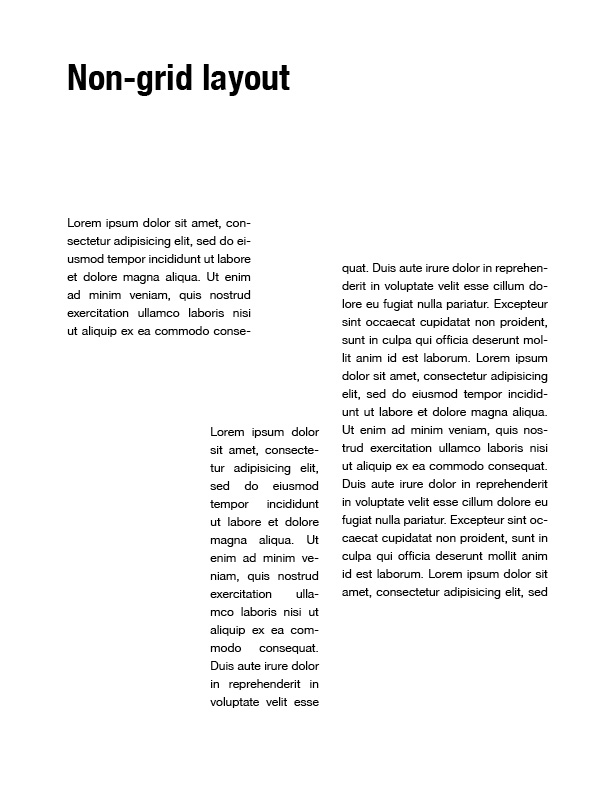
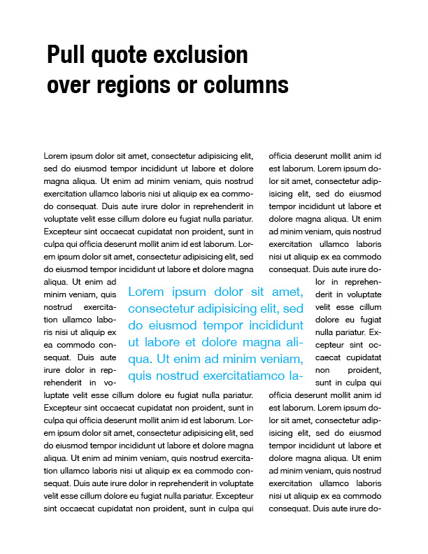
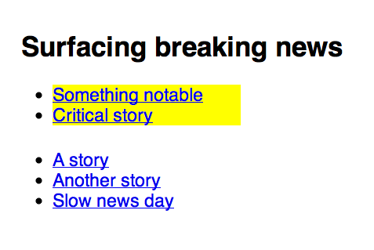
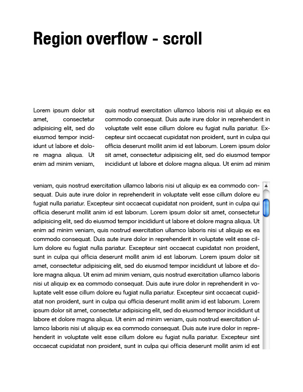
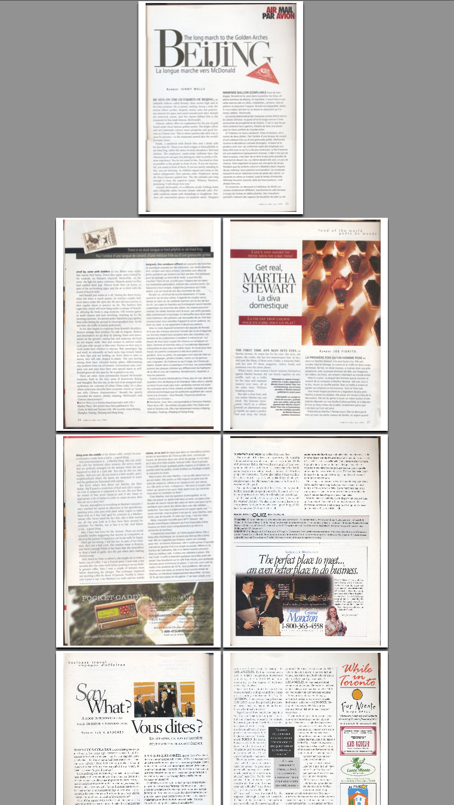

#### Introduction

This page captures use cases for CSS Regions (and exclusions).

CSS Regions can be coupled with [CSS Exclusions and Shapes use cases](../../../ideas/css3-exclusions-use-cases/ "ideas:css3-exclusions-use-cases") for rich layouts with non-rectangular and intruding boxes.

### Flowing content between arbitrary areas

The following image illustrates flowing the same content across regions of different widths. As the content is resized, so are the various regions and the content simply flows between the different regions.


```css
/* extract the content of #source into a named flow - 'article' */
#source {
  flow-into: article;
}
/* page template arranges columns using a flexbox */
.page {
  display:flexbox;
  padding:0.5em
}
/* render the content from the 'article' named flow into .region */
.region {
  flow-from: article;
  background: lightblue;
  margin:0.5em;
}
#region_1, #region_3 { width:flex(1); }
#region_2 { width:flex(1.7); height:40%; }
```

```html
<div id="source">
  <p>Lorem ipsum dolor sit amet ...</p>

<div class="page">
  <div id="region_1" class="region"></div>
  <div id="region_2" class="region"></div>
  <div id="region_3" class="region"></div>

```

### Flowing content between areas of a non-grid layout



```css
/* extract the content of #source into a named flow - 'article' */
#source {
  flow-into: article;
}
/* render the content from the 'article' named flow into .region */
.region {
  flow-from: article;
}
#region_1,
#region_2,
#region_3 {
  position: absolute;
}
#region_1 {
  width:   22%;
  height: 100px;
  top:      0;
  left:     0;
}
#region_2 {
  width:   15%;
  height: 250px;
  bottom:   0;
  left:     30%;
}
#region3 {
  width:    200px;
  height:   320px;
  top:      40px;
  right:    0;
}
```

```html
<div id="source">
  <p>Lorem ipsum dolor sit amet ...</p>

<div id="region_1" class="region"></div>
<div id="region_2" class="region"></div>
<div id="region_3" class="region"></div>
```

### Flowing content between areas and overlapping pull quote exclusion

Use case from Korean News Paper layout: <http://lists.w3.org/Archives/Public/www-archive/2011Oct/att-0033/KoreanNewspapers-exclusionAreas.pdf>. 

Sample with CSS Regions and Exclusions

```css
/* extract the content of #source into a named flow - 'article' */
#source {
  flow-into: article;
}
/* render the content from the 'article' named flow into .region */
.region {
  flow-from: article;
}
#region_1,
#region_2 {
  float: left;
  height: 100%;
}
#region1 {
  width:   60%
}
#region_2 {
  width:   30%
  margin-left: 10%;
}
blockquote {
  position:absolute;
  height: 200px;
  width:   50%;
  left:    25%;
  top:     35%;
  /* exclude surrounding content */
  wrap-flow: both;
  /* prevent the content from touching the edges of the box */
  shape-padding: 20px;
  color: lightblue;
  font-size: 2em;
}
```

```html
    <div id="source">
        <p>Lorem ipsum dolor sit amet ...</p>
    </div>
    <div id="region_1" class="region"></div>
    <div id="region_2" class="region"></div>
    <blockquote>Lorem ipsum dolor ...</blockquote>
```

### Flowing content into transformed areas

See Stagger and Swagger at <http://24ways.org/2009/type-inspired-interfaces>


```css
/* extract the content of #source into a named flow - 'article' */
#source {
  flow-into: article;
}
/* render the content from the 'article' named flow into .region */
.region {
  flow-from: article;
}
#region_1,
#region_2 {
  float: left;
  width:  45%;
  height: 70%;
}
#region_1 {
  transform: rotate(6.5deg);
}
#region_2 {
  transform: rotate(-5.5deg) translate(0, 40px);
}
```

```html
    <div id="source">
        <p>Lorem ipsum dolor sit amet ...</p>
    </div>
    <div id="region_1" class="region"></div>
    <div id="region_2" class="region"></div>
```

### Filtering content - "Breaking news"

With CSS Regions I can filter the content and surface it. Possible use cases: “breaking news” lists, terms of content summary, collecting references from a page, such as bugs or external links.



**Example with extra container**

```css
/* extract the breaking news into a separate named flow - 'breaking-news' */
.breaking{
    background: yellow;
    flow-into: breaking-news;
}
 
.stories,
.breaking-news{
    width:20ex;
    height:5ex;
}
 
/* show only breaking news */
.breaking-news{
    flow-from: breaking-news;
}
```

```html
<h2>Surfacing breaking news</h2>
<ul class="breaking-news"></ul>
 
<ul class="stories">
    <li>[A story](//example.com/story/1)</li>
    <li>[Another story](//example.com/story/2)</li>
    <li class="breaking">[Something notable](//example.com/story/3)</li>
    <li>[Slow news day](//example.com/story/4)</li>
    <li class="breaking">[Critical story](//example.com/story/5)</li>
</ul>
```

**Example with pseudo-element overload**

```css
/* extract the breaking news into a separate named flow - 'breaking-news' */
.breaking{
    background: yellow;
    flow-into: breaking-news;
}
 
.stories,
.stories::before{
    width:20ex;
    height:5ex;
}
 
/* show the breaking news before the other news */
.stories::before{
    flow-from: breaking-news;
 
    /* allow scrolling when content overflows the last region in the named flow */
    region-fragment: auto;
    overflow: auto;
}
```

```html
<h2>Surfacing breaking news</h2>
 
<ul class="stories">
    <li>[A story](//example.com/story/1)</li>
    <li>[Another story](//example.com/story/2)</li>
    <li class="breaking">[Something notable](//example.com/story/3)</li>
    <li>[Slow news day](//example.com/story/4)</li>
    <li class="breaking">[Critical story](//example.com/story/5)</li>
</ul>
```

Idea from [Shadow DOM Example](https://dvcs.w3.org/hg/webcomponents/raw-file/tip/spec/shadow/index.html#shadow-dom-example)

### Converting hard breaks to named flows

Some pages (see [Type Camp India](http://ilovetypography.com/2012/04/06/type-camp-india/)) break up a single article into segments in order to create the layout they want. Instead of using these hard breaks, the content could go into a named flow and the sections could be turned into regions. The regions can then be sized and arranged according to the layout desired and the content flowed smoothly between them.

If you have markup like this:

```html
<div class="segment"><p>Some segment of the content...</p></div>

<div class="segment"><p>...next segment of the content...</p></div>

<div class="segment"><p>...next segment of the content...</p></div>
...
```

You can take the contents of each segment and place them into a named flow:

```css
.segment > * {
  flow-into: combined-segments;
}
```

Then create a region chain out of the segments, usually giving them a height to take up in the layout:

```css
.segment {
  flow-from: combined-segments;
  height: 50vh;
}
```

This works only if the class=“segment” elements have no direct content, because we only have \> \* to work with. It would be better if there was an “all content” selector we could use.

### Capturing region overflow content



```css
/* extract the content of #source into a named flow - 'article' */
#source {
    flow-into: article;
}
 
.region{
    flow-from: article;
}
 
#region1{
    width:25%;
    height:30%;
    float:left;
}
 
#region2{
    width:65%;
    height:30%;
    float:right;
}
 
#region3{
    width:100%;
    height:60%;
    margin-top:10%;
 
    /* Control the overflow behavior of the last region in the named flow */
    region-fragment:auto;
    overflow:auto;
}
```

```html
    <div id="source">
        <p>Lorem ipsum dolor sit amet ...</p>
    </div>
 
    <div id="region1" class="region"></div>
    <div id="region2" class="region"></div>
    <div id="region3" class="region"></div>
```

### Fancy illustration layout


```css
/* extract the content of #source into a named flow - 'article' */
#source{
  flow-into: article;
}
/* render the content from the 'article' named flow into .region */
.region {
  flow-from: article;
}
#piechart {
  position: absolute;
  width:  500px;
  height: 500px;
  right:    0;
}
#slice_1,
#slice_2,
#slice_3,
#slice_4 {
  position: absolute;
  /* prevent text from touching the edges of the slices */
  shape-padding: 10px;
}
#slice_1 {
  /* set the shape of the slice */
  shape-inside: polygon(x1, y1, x2, y2, x3, y3, ... xn, yn);
  /* using SVG for background. shape-inside doesn't affect the box background so background-color won't work */
  background-image: url(green_slice.svg);
  top:    -10px;
  left:   -10px;
}
#slice_2 {
  shape-inside: polygon(x1, y1, x2, y2, x3, y3, ... xn, yn);
  background-image: url(tan_slice.svg);
  top:    200px;
  left:   -20px;
}
#slice_3 {
  shape-inside: polygon(x1, y1, x2, y2, x3, y3, ... xn, yn);
  background-image: url(orange_slice.svg);
  top:    350px;
  bottom: -10px;
}
#slice_4 {
  shape-inside: polygon(x1, y1, x2, y2, x3, y3, ... xn, yn);
  background-image: url(yellow_slice.svg);
  top:      0;
  right:    0;
}
```

```html
<h1>The <em>not so hidden</em> Cost$</h1>
<div id="source">
  <p>Not every meal is going to be ...</p>

<div id="piechart">
  <div id="slice_1" class="region"></div>
  <div id="slice_2" class="region"></div>
  <div id="slice_3" class="region"></div>
  <div id="slice_4" class="region"></div>

```

### Multi-lingual in parallel columns

Pages showing multicolumn layout with two flows, one French and the other English text.

See this real-life example of an airline magazine with english/french side by side.



### Content re-ordering on the client

There are content management systems that assemble markup on demand, but have limited options for changing the markup (and therefore the layout) based on the capabilities of the client that requests a page. One not-so-good solution is to offer a separate 'mobile' page using a different URL if there are layout considerations that require re-ordering the markup to achieve the layout desired on mobile. Using named flows and region chains allows you to define radically different layouts based on media queries in your CSS without changing the underlying markup.

### CSSOM use cases

The spec includes more than the usual amount of CSSOM, as the basic capabilities of named flows and region chains are very well suited to being extended via script. Here are some use cases for the scripting access included in the spec.

1.  Modifying the region chain based on content changes or window resizing. This could involve adding or removing CSS Regions, or changing region geometry. This case makes use of the regionLayoutUpdate event for noticing when changes may be required Then the NamedFlow.overset, NamedFlow.firstEmptyRegionIndex, and Region.regionOverset properties are used to determine what needs done.
2.  Modifying the content based on the region chain. This is the reverse of the first use case. If the size and position of the region chain is fixed, script can modify the contents (usually through font-size) to make it fit. This can take the form of enlarging headlines to fill the available space, or slightly reducing body text size to bring in a few lines of overset text. NamedFlow.overset is particularly useful here.
3.  Handing events on named flow contents - using the OM to determine the CSS Region(s) that contain the content. NamedFlow.getRegionsByContent() allows you to move from the contents to the containers.
4.  Layout extensions implemented via script (script-based layout constraints). If you have a script-based layout system that uses a different set of constraints than existing CSS layout modes, script access to the region chain through NamedFlow.getRegions() and NamedFlow.getRegionsByContent() is required to solve the layout puzzle.
5.  Paginated views. Until pagination has an agreed-upon solution, script-based paginated views will need OM access to named flow contents and region chains. And the eventual agreed-upon pagination solution will likely have some voids that can be filled by script, so OM access will continue to be useful (for a smaller set of requirements).