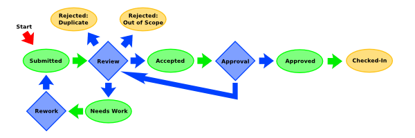

# Test Case Submissions

This page is the index of a test review and submission system.

You need to be logged in to submit a test case. You can create an account on this wiki, or use an OpenID login. (Yahoo and AOL accounts have OpenID.) To submit a test case [submit this form](http://csswg.inkedblade.net/submit-test.pl?css2.1) and fill out the title, url, and contributor fields.

Test submissions are subject to the [review process](../../../test/review/ "test:review"). A test, once submitted (see below), can be accepted and recommended for inclusion or rejected for various reasons by changing the submission status. The reviewer should add a comment with rationale whenever changing the test status. A typical review process is diagrammed below:

Each test submitted into this system has a status. Possible status tags are:

Submitted
: The test case has been submitted for review

OutOfScope
: The test case is testing something that is out-of-scope for this module and is therefore rejected for inclusion.

SpecIssue
: The test case is testing behavior which is ambiguous or not-yet-resolved in the spec, so acceptance is pending resolution of a spec issue.

Duplicate
: The test case is a duplicate of an existing test case in the test suite and is therefore rejected for inclusion

NeedsWork
: The test case needs further work before it is ready for inclusion, and should be resubmitted once the requested improvements have been made. (The reviewer setting this status must explain what problems the testcase has.)

Resubmitted
: The test case has been resubmitted for review after previous review comments have been addressed.

Accepted
: The test case has passed review and is recommended for inclusion in the test suite.

Approved
: The test case has been approved by a test suite Peer. Someone with write access needs to check it in.

CheckedIn
: The test case has been reviewed, approved, and checked in. (The test case URL should be updated to match the official w3.org copy.)

You don't need to be logged in to review testcases and make recommendations in the comment system, but you will need to be logged in to change the status tag. An OpenID login is sufficient for that.

## Submitted Test Cases

- [Accepted](../../../test/css2.1/submit/?dataflt%5B0%5D=status_%3DAccepted "Show pages matching 'Accepted'")
- [Closed](../../../test/css2.1/submit/?dataflt%5B0%5D=status_%3DClosed "Show pages matching 'Closed'")
- [Deleted](../../../test/css2.1/submit/?dataflt%5B0%5D=status_%3DDeleted "Show pages matching 'Deleted'")
- [Duplicate](../../../test/css2.1/submit/?dataflt%5B0%5D=status_%3DDuplicate "Show pages matching 'Duplicate'")
- [NeedsWork](../../../test/css2.1/submit/?dataflt%5B0%5D=status_%3DNeedsWork "Show pages matching 'NeedsWork'")
- [Open](../../../test/css2.1/submit/?dataflt%5B0%5D=status_%3DOpen "Show pages matching 'Open'")
- [OutOfScope](../../../test/css2.1/submit/?dataflt%5B0%5D=status_%3DOutOfScope "Show pages matching 'OutOfScope'")
- [Resolved](../../../test/css2.1/submit/?dataflt%5B0%5D=status_%3DResolved "Show pages matching 'Resolved'")
- [SpecIssue](../../../test/css2.1/submit/?dataflt%5B0%5D=status_%3DSpecIssue "Show pages matching 'SpecIssue'")
- [Submitted](../../../test/css2.1/submit/?dataflt%5B0%5D=status_%3DSubmitted "Show pages matching 'Submitted'")

<!-- -->

- [BreakBefore](../../../test/css2.1/submit/?dataflt%5B0%5D=group_%3DBreakBefore "Show pages matching 'BreakBefore'")
- [BreakInside](../../../test/css2.1/submit/?dataflt%5B0%5D=group_%3DBreakInside "Show pages matching 'BreakInside'")
- [DimensionOfMarginBoxesBottomRow](../../../test/css2.1/submit/?dataflt%5B0%5D=group_%3DDimensionOfMarginBoxesBottomRow "Show pages matching 'DimensionOfMarginBoxesBottomRow'")
- [DimensionOfMarginBoxesTopRow](../../../test/css2.1/submit/?dataflt%5B0%5D=group_%3DDimensionOfMarginBoxesTopRow "Show pages matching 'DimensionOfMarginBoxesTopRow'")
- [ImageOrientation](../../../test/css2.1/submit/?dataflt%5B0%5D=group_%3DImageOrientation "Show pages matching 'ImageOrientation'")
- [Images](../../../test/css2.1/submit/?dataflt%5B0%5D=group_%3DImages "Show pages matching 'Images'")
- [MarginBoxes](../../../test/css2.1/submit/?dataflt%5B0%5D=group_%3DMarginBoxes "Show pages matching 'MarginBoxes'")
- [Orphans](../../../test/css2.1/submit/?dataflt%5B0%5D=group_%3DOrphans "Show pages matching 'Orphans'")
- [PageBreaks](../../../test/css2.1/submit/?dataflt%5B0%5D=group_%3DPageBreaks "Show pages matching 'PageBreaks'")
- [PageProperties](../../../test/css2.1/submit/?dataflt%5B0%5D=group_%3DPageProperties "Show pages matching 'PageProperties'")
- [PageSize](../../../test/css2.1/submit/?dataflt%5B0%5D=group_%3DPageSize "Show pages matching 'PageSize'")
- [Widows](../../../test/css2.1/submit/?dataflt%5B0%5D=group_%3DWidows "Show pages matching 'Widows'")

<table class="inline dataplugin_table">
<thead>
<tr>
<th>[Submission](../../../test/css2.1/submit/?datasrt=%25pageid%25)</th>
<th>[Status](../../../test/css2.1/submit/?datasrt=status)</th>
<th>[Authors](../../../test/css2.1/submit/?datasrt=author)</th>
<th>[Groups](../../../test/css2.1/submit/?datasrt=group)</th>
<th>[URL](../../../test/css2.1/submit/?datasrt=testcase)</th>
</tr>
</thead>
<tbody>
<tr>
<td class="align pageid">[Test Title](../../../test/css2.1/submit/1/)</td>
<td class="align status">Submitted</td>
<td class="align author"></td>
<td class="align group"></td>
<td class="align testcase">[http://www.example.com/test-topic-000.xht](http://www.example.com/test-topic-000.xht)</td>
</tr>
<tr>
<td class="align pageid">[CSS Test: page-break-after: auto](../../../test/css2.1/submit/10/)</td>
<td class="align status">Deleted</td>
<td class="align author">Tom Clancy</td>
<td class="align group">Rev2100, PageBreaks, BreaksAfter</td>
<td class="align testcase">[http://www.revenutiontesting.com/w3c/page-break-after-005-a.xht](http://www.revenutiontesting.com/w3c/page-break-after-005-a.xht)</td>
</tr>
<tr>
<td class="align pageid">[CSS Test: Image Orientation - Negative Values](../../../test/css2.1/submit/100/)</td>
<td class="align status">Accepted</td>
<td class="align author">Tom Clancy</td>
<td class="align group">Rev2790, Images, ImageOrientation</td>
<td class="align testcase">[http://test.csswg.org/svn/submitted/css3-page/img-orient-012.xht](http://test.csswg.org/svn/submitted/css3-page/img-orient-012.xht)</td>
</tr>
<tr>
<td class="align pageid">[CSS Test: Image Fit - The initial value of the 'image-fit' property is 'fill'](../../../test/css2.1/submit/101/)</td>
<td class="align status">Accepted</td>
<td class="align author">Tom Clancy</td>
<td class="align group">Rev2820</td>
<td class="align testcase">[http://test.csswg.org/svn/submitted/css3-page/image-fit-001.xht](http://test.csswg.org/svn/submitted/css3-page/image-fit-001.xht)</td>
</tr>
<tr>
<td class="align pageid">[CSS Test: Image Fit - 'fill', explicit 'height'/'width'](../../../test/css2.1/submit/102/)</td>
<td class="align status">Deleted</td>
<td class="align author">Tom Clancy</td>
<td class="align group">Rev2870</td>
<td class="align testcase">[http://www.revenutiontesting.com/w3c/image-fit-005.xht](http://www.revenutiontesting.com/w3c/image-fit-005.xht)</td>
</tr>
<tr>
<td class="align pageid">[CSS Test: Image Fit - Height and width are independent when image-fit is 'fill'](../../../test/css2.1/submit/103/)</td>
<td class="align status">Accepted</td>
<td class="align author">Tom Clancy</td>
<td class="align group">Rev2880</td>
<td class="align testcase">[http://test.csswg.org/svn/submitted/css3-page/image-fit-006.xht](http://test.csswg.org/svn/submitted/css3-page/image-fit-006.xht)</td>
</tr>
<tr>
<td class="align pageid">[CSS Test: Image Fit - Height and width are independent when image-fit is 'contain' and no max-width or max-height is set](../../../test/css2.1/submit/104/)</td>
<td class="align status">Duplicate</td>
<td class="align author">Tom Clancy</td>
<td class="align group">Rev2890</td>
<td class="align testcase">[http://www.revenutiontesting.com/w3c/image-fit-007-a.xht](http://www.revenutiontesting.com/w3c/image-fit-007-a.xht)</td>
</tr>
<tr>
<td class="align pageid">[CSS Test: Image Fit - Laying out image when image-fit is 'contain' and max-width is set](../../../test/css2.1/submit/105/)</td>
<td class="align status">Duplicate</td>
<td class="align author">Tom Clancy</td>
<td class="align group">Rev2900</td>
<td class="align testcase">[http://www.revenutiontesting.com/w3c/image-fit-007-b.xht](http://www.revenutiontesting.com/w3c/image-fit-007-b.xht)</td>
</tr>
<tr>
<td class="align pageid">[CSS Test: Image Fit - Laying out image when image-fit is 'contain' and max-height is set](../../../test/css2.1/submit/106/)</td>
<td class="align status">Duplicate</td>
<td class="align author">Tom Clancy</td>
<td class="align group">Rev2910</td>
<td class="align testcase">[http://www.revenutiontesting.com/w3c/image-fit-007-c.xht](http://www.revenutiontesting.com/w3c/image-fit-007-c.xht)</td>
</tr>
<tr>
<td class="align pageid">[CSS Test: Image Fit - Overflow determines how to render content outside a replaced element's box](../../../test/css2.1/submit/107/)</td>
<td class="align status">Submitted</td>
<td class="align author">Tom Clancy</td>
<td class="align group">Rev2950</td>
<td class="align testcase">[http://www.revenutiontesting.com/w3c/image-fit-011.xht](http://www.revenutiontesting.com/w3c/image-fit-011.xht)</td>
</tr>
<tr>
<td class="align pageid">[CSS Test: Image Position Syntax - Initial Value](../../../test/css2.1/submit/108/)</td>
<td class="align status">Accepted</td>
<td class="align author">Tom Clancy</td>
<td class="align group">Rev2970</td>
<td class="align testcase">[http://www.revenutiontesting.com/w3c/image-position-001.xht](http://www.revenutiontesting.com/w3c/image-position-001.xht)</td>
</tr>
<tr>
<td class="align pageid">[CSS Test: Image Position Syntax - Replaced Elements Only](../../../test/css2.1/submit/109/)</td>
<td class="align status">Accepted</td>
<td class="align author">Tom Clancy</td>
<td class="align group">Rev2980</td>
<td class="align testcase">[http://www.revenutiontesting.com/w3c/image-position-002.xht](http://www.revenutiontesting.com/w3c/image-position-002.xht)</td>
</tr>
<tr>
<td class="align pageid">[CSS Test: @page page-break-inside (inline elements)](../../../test/css2.1/submit/11/)</td>
<td class="align status">NeedsWork</td>
<td class="align author">Tom Clancy</td>
<td class="align group">Rev2220</td>
<td class="align testcase">[http://www.revenutiontesting.com/w3c/page-break-inside-002.xht](http://www.revenutiontesting.com/w3c/page-break-inside-002.xht)</td>
</tr>
<tr>
<td class="align pageid">[CSS Test: Image Position Syntax - Inheritance](../../../test/css2.1/submit/110/)</td>
<td class="align status">Accepted</td>
<td class="align author">Tom Clancy</td>
<td class="align group">Rev2990</td>
<td class="align testcase">[http://www.revenutiontesting.com/w3c/image-position-003.xht](http://www.revenutiontesting.com/w3c/image-position-003.xht)</td>
</tr>
<tr>
<td class="align pageid">[CSS Test: Image Position Syntax - Visual Media](../../../test/css2.1/submit/111/)</td>
<td class="align status">Accepted</td>
<td class="align author">Tom Clancy</td>
<td class="align group">Rev3000</td>
<td class="align testcase">[http://www.revenutiontesting.com/w3c/image-position-004.xht](http://www.revenutiontesting.com/w3c/image-position-004.xht)</td>
</tr>
<tr>
<td class="align pageid">[CSS Test: page-break-before explicit auto test](../../../test/css2.1/submit/112/)</td>
<td class="align status">Duplicate</td>
<td class="align author">Tom Clancy</td>
<td class="align group">Rev2000, PageBreaks, BreakBefore</td>
<td class="align testcase">[http://www.revenutiontesting.com/w3c/page-break-before-007-b.xht](http://www.revenutiontesting.com/w3c/page-break-before-007-b.xht)</td>
</tr>
<tr>
<td class="align pageid">[CSS Test: page-break-after: auto](../../../test/css2.1/submit/113/)</td>
<td class="align status">Accepted</td>
<td class="align author">Tom Clancy</td>
<td class="align group">Rev2110, PageBreaks, BreaksAfter</td>
<td class="align testcase">[http://test.csswg.org/svn/submitted/css2.1/page/page-break-after-005.xht](http://test.csswg.org/svn/submitted/css2.1/page/page-break-after-005.xht)</td>
</tr>
<tr>
<td class="align pageid">[CSS Test: Margin Boxes - Bottom](../../../test/css2.1/submit/114/)</td>
<td class="align status">Accepted</td>
<td class="align author">Tom Clancy</td>
<td class="align group">Rev1530, DimensionOfMarginBoxesBottomRow, MarginBoxes</td>
<td class="align testcase">[http://www.revenutiontesting.com/w3c/page-mbox-018-b.xht](http://www.revenutiontesting.com/w3c/page-mbox-018-b.xht)</td>
</tr>
<tr>
<td class="align pageid">[CSS Test: Vertical-align affects layout of margin boxes](../../../test/css2.1/submit/115/)</td>
<td class="align status">Duplicate</td>
<td class="align author">Tom Clancy</td>
<td class="align group">Rev1930</td>
<td class="align testcase">[http://www.revenutiontesting.com/w3c/mbox-vertical-align-000.xht](http://www.revenutiontesting.com/w3c/mbox-vertical-align-000.xht)</td>
</tr>
<tr>
<td class="align pageid">[CSS Test: @page page-break-inside not inherited](../../../test/css2.1/submit/116/)</td>
<td class="align status">SpecIssue</td>
<td class="align author">Tom Clancy</td>
<td class="align group">Rev2230</td>
<td class="align testcase">[http://www.revenutiontesting.com/w3c/page-break-inside-005.xht](http://www.revenutiontesting.com/w3c/page-break-inside-005.xht)</td>
</tr>
<tr>
<td class="align pageid">[CSS Test: @page border property points](../../../test/css2.1/submit/117/)</td>
<td class="align status">Submitted</td>
<td class="align author">Tom Clancy</td>
<td class="align group">Rev0170</td>
<td class="align testcase">[http://www.revenutiontesting.com/w3c/at-page-rule-002-o.xht](http://www.revenutiontesting.com/w3c/at-page-rule-002-o.xht)</td>
</tr>
<tr>
<td class="align pageid">[CSS Test: @page border property physical units](../../../test/css2.1/submit/118/)</td>
<td class="align status">Submitted</td>
<td class="align author">Tom Clancy</td>
<td class="align group">Rev0180</td>
<td class="align testcase">[http://www.revenutiontesting.com/w3c/at-page-rule-002-p.xht](http://www.revenutiontesting.com/w3c/at-page-rule-002-p.xht)</td>
</tr>
<tr>
<td class="align pageid">[CSS Test: page-break-before: left](../../../test/css2.1/submit/119/)</td>
<td class="align status">Submitted</td>
<td class="align author">Tom Clancy</td>
<td class="align group">Rev2060, PageBreaks</td>
<td class="align testcase">[http://www.revenutiontesting.com/w3c/page-break-before-003.xht](http://www.revenutiontesting.com/w3c/page-break-before-003.xht)</td>
</tr>
<tr>
<td class="align pageid">[Using named pages - block boxes with different page properties are split onto different pages](../../../test/css2.1/submit/12/)</td>
<td class="align status">Submitted</td>
<td class="align author">Tom Clancy</td>
<td class="align group">Rev2320</td>
<td class="align testcase">[http://www.revenutiontesting.com/w3c/page-name-003.xht](http://www.revenutiontesting.com/w3c/page-name-003.xht)</td>
</tr>
<tr>
<td class="align pageid">[CSS Test: page-break-before: right](../../../test/css2.1/submit/120/)</td>
<td class="align status">Submitted</td>
<td class="align author">Tom Clancy</td>
<td class="align group">Rev2070, PageBreaks</td>
<td class="align testcase">[http://www.revenutiontesting.com/w3c/page-break-before-005.xht](http://www.revenutiontesting.com/w3c/page-break-before-005.xht)</td>
</tr>
<tr>
<td class="align pageid">[CSS Test: @page page-break-inside:avoid](../../../test/css2.1/submit/121/)</td>
<td class="align status">Accepted</td>
<td class="align author">Tom Clancy</td>
<td class="align group">Rev2260, PageBreaks</td>
<td class="align testcase">[http://test.csswg.org/svn/submitted/css2.1/page/page-break-inside-001.xht](http://test.csswg.org/svn/submitted/css2.1/page/page-break-inside-001.xht)</td>
</tr>
<tr>
<td class="align pageid">[CSS Test: @page page-break-inside invalid syntax](../../../test/css2.1/submit/122/)</td>
<td class="align status">Accepted</td>
<td class="align author">Tom Clancy</td>
<td class="align group">Rev2200, PageBreaks</td>
<td class="align testcase">[http://test.csswg.org/svn/submitted/css2.1/page/page-break-inside-003.xht](http://test.csswg.org/svn/submitted/css2.1/page/page-break-inside-003.xht)</td>
</tr>
<tr>
<td class="align pageid">[CSS Test: @page page-break-inside:auto](../../../test/css2.1/submit/123/)</td>
<td class="align status">Accepted</td>
<td class="align author">Tom Clancy</td>
<td class="align group">Rev2210, PageBreaks</td>
<td class="align testcase">[http://test.csswg.org/svn/submitted/css2.1/page/page-break-inside-004.xht](http://test.csswg.org/svn/submitted/css2.1/page/page-break-inside-004.xht)</td>
</tr>
<tr>
<td class="align pageid">[CSS Test: Page Size - size property](../../../test/css2.1/submit/124/)</td>
<td class="align status">Submitted</td>
<td class="align author">Tom Clancy</td>
<td class="align group">Rev0500</td>
<td class="align testcase">[http://www.revenutiontesting.com/w3c/page-size-004.xht](http://www.revenutiontesting.com/w3c/page-size-004.xht)</td>
</tr>
<tr>
<td class="align pageid">[CSS Test: Page Selector Grammar - @page auto](../../../test/css2.1/submit/125/)</td>
<td class="align status">Submitted</td>
<td class="align author">Tom Clancy</td>
<td class="align group">Rev0800</td>
<td class="align testcase">[http://www.revenutiontesting.com/w3c/page-name-004.xht](http://www.revenutiontesting.com/w3c/page-name-004.xht)</td>
</tr>
<tr>
<td class="align pageid">[CSS Test: Calculating Specificity for Page at-rules](../../../test/css2.1/submit/126/)</td>
<td class="align status">Submitted</td>
<td class="align author">Tom Clancy</td>
<td class="align group">Rev0820</td>
<td class="align testcase">[http://www.revenutiontesting.com/w3c/page-cascade-000.xht](http://www.revenutiontesting.com/w3c/page-cascade-000.xht)</td>
</tr>
<tr>
<td class="align pageid">[CSS Test: page properties: color](../../../test/css2.1/submit/127/)</td>
<td class="align status">Submitted</td>
<td class="align author">Tom Clancy</td>
<td class="align group">Rev1040, PageProperties</td>
<td class="align testcase">[http://www.revenutiontesting.com/w3c/page_properties/page-properties-016.xht](http://www.revenutiontesting.com/w3c/page_properties/page-properties-016.xht)</td>
</tr>
<tr>
<td class="align pageid">[CSS Test: page properties: text properties](../../../test/css2.1/submit/128/)</td>
<td class="align status">Submitted</td>
<td class="align author">Tom Clancy</td>
<td class="align group">Rev1060, PageProperties</td>
<td class="align testcase">[http://www.revenutiontesting.com/w3c/page_properties/page-properties-018.xht](http://www.revenutiontesting.com/w3c/page_properties/page-properties-018.xht)</td>
</tr>
<tr>
<td class="align pageid">[CSS Test: Margin Boxes - Top](../../../test/css2.1/submit/129/)</td>
<td class="align status">Submitted</td>
<td class="align author">Tom Clancy</td>
<td class="align group">Rev1340, MarginBoxes</td>
<td class="align testcase">[http://www.revenutiontesting.com/w3c/page-mbox-005.xht](http://www.revenutiontesting.com/w3c/page-mbox-005.xht)</td>
</tr>
<tr>
<td class="align pageid">[CSS Test: Margin Boxes - Top Center's Left Margin](../../../test/css2.1/submit/13/)</td>
<td class="align status">Submitted</td>
<td class="align author">Tom Clancy</td>
<td class="align group">Rev1390, DimensionOfMarginBoxesTopRow, MarginBoxes</td>
<td class="align testcase">[http://www.revenutiontesting.com/w3c/page-mbox-010.xht](http://www.revenutiontesting.com/w3c/page-mbox-010.xht)</td>
</tr>
<tr>
<td class="align pageid">[CSS Test: Margin Boxes - Top Margin Boxes](../../../test/css2.1/submit/130/)</td>
<td class="align status">Submitted</td>
<td class="align author">Tom Clancy</td>
<td class="align group">Rev1430, MarginBoxes</td>
<td class="align testcase">[http://www.revenutiontesting.com/w3c/page-mbox-013-b.xht](http://www.revenutiontesting.com/w3c/page-mbox-013-b.xht)</td>
</tr>
<tr>
<td class="align pageid">[CSS Test: Margin Boxes - Top Left Margin](../../../test/css2.1/submit/131/)</td>
<td class="align status">Duplicate</td>
<td class="align author">Tom Clancy</td>
<td class="align group">Rev1430, MarginBoxes</td>
<td class="align testcase">[http://www.revenutiontesting.com/w3c/page-mbox-013-b.xht](http://www.revenutiontesting.com/w3c/page-mbox-013-b.xht)</td>
</tr>
<tr>
<td class="align pageid">[CSS Test: Margin Boxes - Top Left's Left Margin](../../../test/css2.1/submit/132/)</td>
<td class="align status">Accepted</td>
<td class="align author">Tom Clancy</td>
<td class="align group">Rev1380, DimensionOfMarginBoxesTopRow, MarginBoxes</td>
<td class="align testcase">[http://www.revenutiontesting.com/w3c/page-mbox-009.xht](http://www.revenutiontesting.com/w3c/page-mbox-009.xht)</td>
</tr>
<tr>
<td class="align pageid">[CSS Test: Margin Boxes - Top Box Widths](../../../test/css2.1/submit/133/)</td>
<td class="align status">Submitted</td>
<td class="align author">Tom Clancy</td>
<td class="align group">Rev1350, MarginBoxes</td>
<td class="align testcase">[http://www.revenutiontesting.com/w3c/page-mbox-006.xht](http://www.revenutiontesting.com/w3c/page-mbox-006.xht)</td>
</tr>
<tr>
<td class="align pageid">[CSS Test: Margin Boxes - Top Left Box Width](../../../test/css2.1/submit/134/)</td>
<td class="align status">Submitted</td>
<td class="align author">Tom Clancy</td>
<td class="align group">Rev1360, MarginBoxes</td>
<td class="align testcase">[http://www.revenutiontesting.com/w3c/page-mbox-007.xht](http://www.revenutiontesting.com/w3c/page-mbox-007.xht)</td>
</tr>
<tr>
<td class="align pageid">[CSS Test: Margin Boxes - Top Left Box Width](../../../test/css2.1/submit/135/)</td>
<td class="align status">Submitted</td>
<td class="align author">Tom Clancy</td>
<td class="align group">Rev1375, MarginBoxes</td>
<td class="align testcase">[http://www.revenutiontesting.com/w3c/page-mbox-054.xht](http://www.revenutiontesting.com/w3c/page-mbox-054.xht)</td>
</tr>
<tr>
<td class="align pageid">[CSS Test: size of the page box](../../../test/css2.1/submit/136/)</td>
<td class="align status">Submitted</td>
<td class="align author">Tom Clancy</td>
<td class="align group">Rev0200</td>
<td class="align testcase">[http://www.revenutiontesting.com/w3c/at-page-rule-004.xht](http://www.revenutiontesting.com/w3c/at-page-rule-004.xht)</td>
</tr>
<tr>
<td class="align pageid">[CSS Test: Margin Boxes - Bottom](../../../test/css2.1/submit/137/)</td>
<td class="align status">Submitted</td>
<td class="align author">Tom Clancy</td>
<td class="align group">Rev1550, DimensionOfMarginBoxesBottomRow, MarginBoxes</td>
<td class="align testcase">[http://www.revenutiontesting.com/w3c/page-mbox-020.xht](http://www.revenutiontesting.com/w3c/page-mbox-020.xht)</td>
</tr>
<tr>
<td class="align pageid">[CSS Test: Margin Boxes - Bottom](../../../test/css2.1/submit/138/)</td>
<td class="align status">Submitted</td>
<td class="align author">Tom Clancy</td>
<td class="align group">Rev1360, DimensionOfMarginBoxesBottomRow, MarginBoxes</td>
<td class="align testcase">[http://www.revenutiontesting.com/w3c/page-mbox-021.xht](http://www.revenutiontesting.com/w3c/page-mbox-021.xht)</td>
</tr>
<tr>
<td class="align pageid">[CSS Test: Margin Boxes - Left Top Box Width](../../../test/css2.1/submit/139/)</td>
<td class="align status">Submitted</td>
<td class="align author">Tom Clancy</td>
<td class="align group">Rev1680, DimensionOfMarginBoxesLeftRow, MarginBoxes</td>
<td class="align testcase">[http://www.revenutiontesting.com/w3c/page-mbox-032.xht](http://www.revenutiontesting.com/w3c/page-mbox-032.xht)</td>
</tr>
<tr>
<td class="align pageid">[CSS Test: Margin Boxes - Top](../../../test/css2.1/submit/14/)</td>
<td class="align status">Accepted</td>
<td class="align author">Tom Clancy</td>
<td class="align group">Rev1400, DimensionOfMarginBoxesTopRow, MarginBoxes</td>
<td class="align testcase">[http://www.revenutiontesting.com/w3c/page-mbox-011.xht](http://www.revenutiontesting.com/w3c/page-mbox-011.xht)</td>
</tr>
<tr>
<td class="align pageid">[CSS Test: Margin Boxes - Left Bottom Box Width](../../../test/css2.1/submit/140/)</td>
<td class="align status">Submitted</td>
<td class="align author">Tom Clancy</td>
<td class="align group">Rev1700, DimensionOfMarginBoxesLeftRow, MarginBoxes</td>
<td class="align testcase">[http://www.revenutiontesting.com/w3c/page-mbox-034.xht](http://www.revenutiontesting.com/w3c/page-mbox-034.xht)</td>
</tr>
<tr>
<td class="align pageid">[CSS Test: Margin Boxes - Right Top Box Width](../../../test/css2.1/submit/141/)</td>
<td class="align status">Submitted</td>
<td class="align author">Tom Clancy</td>
<td class="align group">Rev1820, DimensionOfMarginBoxesRightRow, MarginBoxes</td>
<td class="align testcase">[http://www.revenutiontesting.com/w3c/page-mbox-044.xht](http://www.revenutiontesting.com/w3c/page-mbox-044.xht)</td>
</tr>
<tr>
<td class="align pageid">[CSS Test: Margin Boxes - Right Bottom Box Width](../../../test/css2.1/submit/142/)</td>
<td class="align status">Submitted</td>
<td class="align author">Tom Clancy</td>
<td class="align group">Rev1840, DimensionOfMarginBoxesRightRow, MarginBoxes</td>
<td class="align testcase">[http://www.revenutiontesting.com/w3c/page-mbox-046.xht](http://www.revenutiontesting.com/w3c/page-mbox-046.xht)</td>
</tr>
<tr>
<td class="align pageid">[CSS3 Test Suite: Margin Boxes - Top Center](../../../test/css2.1/submit/143/)</td>
<td class="align status">Submitted</td>
<td class="align author">Tom Clancy</td>
<td class="align group">Rev0270, MarginBoxes</td>
<td class="align testcase">[http://www.revenutiontesting.com/w3c/margin-boxes-005.xht](http://www.revenutiontesting.com/w3c/margin-boxes-005.xht)</td>
</tr>
<tr>
<td class="align pageid">[CSS3 Test Suite: Margin Boxes - Bottom Center](../../../test/css2.1/submit/144/)</td>
<td class="align status">Submitted</td>
<td class="align author">Tom Clancy</td>
<td class="align group">Rev0380, MarginBoxes</td>
<td class="align testcase">[http://www.revenutiontesting.com/w3c/margin-boxes-016.xht](http://www.revenutiontesting.com/w3c/margin-boxes-016.xht)</td>
</tr>
<tr>
<td class="align pageid">[CSS3 Test Suite: Margin Boxes - Left Middle](../../../test/css2.1/submit/145/)</td>
<td class="align status">Submitted</td>
<td class="align author">Tom Clancy</td>
<td class="align group">Rev0310, MarginBoxes</td>
<td class="align testcase">[http://www.revenutiontesting.com/w3c/margin-boxes-009.xht](http://www.revenutiontesting.com/w3c/margin-boxes-009.xht)</td>
</tr>
<tr>
<td class="align pageid">[CSS3 Test Suite: Margin Boxes - Right Middle](../../../test/css2.1/submit/146/)</td>
<td class="align status">Submitted</td>
<td class="align author">Tom Clancy</td>
<td class="align group">Rev0340, MarginBoxes</td>
<td class="align testcase">[http://www.revenutiontesting.com/w3c/margin-boxes-012.xht](http://www.revenutiontesting.com/w3c/margin-boxes-012.xht)</td>
</tr>
<tr>
<td class="align pageid">[CSS Test: Adjustments to fit content to page must obey guidelines (over-sized)](../../../test/css2.1/submit/147/)</td>
<td class="align status">Submitted</td>
<td class="align author">Tom Clancy</td>
<td class="align group">Rev0220</td>
<td class="align testcase">[http://www.revenutiontesting.com/w3c/page-scaling-000-a.xht](http://www.revenutiontesting.com/w3c/page-scaling-000-a.xht)</td>
</tr>
<tr>
<td class="align pageid">[CSS Test: Adjustments to fit content to page must obey guidelines (letter-sized)](../../../test/css2.1/submit/148/)</td>
<td class="align status">Submitted</td>
<td class="align author">Tom Clancy</td>
<td class="align group">Rev0230</td>
<td class="align testcase">[http://www.revenutiontesting.com/w3c/page-scaling-000-b.xht](http://www.revenutiontesting.com/w3c/page-scaling-000-b.xht)</td>
</tr>
<tr>
<td class="align pageid">[CSS Test: Adjustments to fit content to page must obey guidelines (small page)](../../../test/css2.1/submit/149/)</td>
<td class="align status">OutOfScope</td>
<td class="align author">Tom Clancy</td>
<td class="align group">Rev0240</td>
<td class="align testcase">[http://www.revenutiontesting.com/w3c/page-scaling-000-c.xht](http://www.revenutiontesting.com/w3c/page-scaling-000-c.xht)</td>
</tr>
<tr>
<td class="align pageid">[CSS Test: Margin Boxes - Bottom](../../../test/css2.1/submit/15/)</td>
<td class="align status">Accepted</td>
<td class="align author">Tom Clancy</td>
<td class="align group">Rev1520, DimensionOfMarginBoxesBottomRow, MarginBoxes</td>
<td class="align testcase">[http://www.revenutiontesting.com/w3c/page-mbox-018-a.xht](http://www.revenutiontesting.com/w3c/page-mbox-018-a.xht)</td>
</tr>
<tr>
<td class="align pageid">[CSS Test: Page Size - Handling Page Size](../../../test/css2.1/submit/150/)</td>
<td class="align status">Submitted</td>
<td class="align author">Tom Clancy</td>
<td class="align group">Rev0590, PageSize</td>
<td class="align testcase">[http://www.revenutiontesting.com/w3c/page-size-011.xht](http://www.revenutiontesting.com/w3c/page-size-011.xht)</td>
</tr>
<tr>
<td class="align pageid">[CSS Test: Page Size - Handling Page Size](../../../test/css2.1/submit/151/)</td>
<td class="align status">Submitted</td>
<td class="align author">Tom Clancy</td>
<td class="align group">Rev0600, PageSize</td>
<td class="align testcase">[http://www.revenutiontesting.com/w3c/page-size-012.xht](http://www.revenutiontesting.com/w3c/page-size-012.xht)</td>
</tr>
<tr>
<td class="align pageid">[CSS Test: Image Fit - contain with height/width auto](../../../test/css2.1/submit/152/)</td>
<td class="align status">Submitted</td>
<td class="align author">Tom Clancy</td>
<td class="align group">Rev2900</td>
<td class="align testcase">[http://www.revenutiontesting.com/w3c/image-fit-007.xht](http://www.revenutiontesting.com/w3c/image-fit-007.xht)</td>
</tr>
<tr>
<td class="align pageid">[CSS Test: Image Orientation - Default Value is '0deg'](../../../test/css2.1/submit/153/)</td>
<td class="align status">Submitted</td>
<td class="align author">Tom Clancy</td>
<td class="align group">Rev2620, Images, ImageOrientation</td>
<td class="align testcase">[http://www.revenutiontesting.com/w3c/img-orient-002.xht](http://www.revenutiontesting.com/w3c/img-orient-002.xht)</td>
</tr>
<tr>
<td class="align pageid">[CSS Test: orphans property syntax - invalid decimal](../../../test/css2.1/submit/154/)</td>
<td class="align status">Accepted</td>
<td class="align author">Tom Clancy</td>
<td class="align group">Rev2350, PageBreaks, BreakInside, Orphans</td>
<td class="align testcase">[http://test.csswg.org/svn/submitted/css2.1/page/orphans-000-b.xht](http://test.csswg.org/svn/submitted/css2.1/page/orphans-000-b.xht)</td>
</tr>
<tr>
<td class="align pageid">[CSS Test: orphans property syntax - invalid negative](../../../test/css2.1/submit/155/)</td>
<td class="align status">Accepted</td>
<td class="align author">Tom Clancy</td>
<td class="align group">Rev2360, PageBreaks, BreakInside, Orphans</td>
<td class="align testcase">[http://test.csswg.org/svn/submitted/css2.1/page/orphans-000-c.xht](http://test.csswg.org/svn/submitted/css2.1/page/orphans-000-c.xht)</td>
</tr>
<tr>
<td class="align pageid">[CSS Test: widows property syntax - integer](../../../test/css2.1/submit/156/)</td>
<td class="align status">Accepted</td>
<td class="align author">Tom Clancy</td>
<td class="align group">Rev2340, PageBreaks, BreakInside, Widows</td>
<td class="align testcase">[http://test.csswg.org/svn/submitted/css2.1/page/widows-000-a.xht](http://test.csswg.org/svn/submitted/css2.1/page/widows-000-a.xht)</td>
</tr>
<tr>
<td class="align pageid">[CSS Test: widows property syntax - invalid decimal](../../../test/css2.1/submit/157/)</td>
<td class="align status">Submitted</td>
<td class="align author">Tom Clancy</td>
<td class="align group">Rev2410, PageBreaks, BreakInside, Widows</td>
<td class="align testcase">[http://test.csswg.org/svn/submitted/css2.1/page/widows-000-b.xht](http://test.csswg.org/svn/submitted/css2.1/page/widows-000-b.xht)</td>
</tr>
<tr>
<td class="align pageid">[CSS Test: widows property syntax - invalid negative](../../../test/css2.1/submit/158/)</td>
<td class="align status">Submitted</td>
<td class="align author">Tom Clancy</td>
<td class="align group">Rev2420, PageBreaks, BreakInside, Widows</td>
<td class="align testcase">[http://www.revenutiontesting.com/w3c/breaks_inside_elements/widows-000-c.xht](http://www.revenutiontesting.com/w3c/breaks_inside_elements/widows-000-c.xht)</td>
</tr>
<tr>
<td class="align pageid">[CSS Test: Positioning Undersized Page Box](../../../test/css2.1/submit/159/)</td>
<td class="align status">Submitted</td>
<td class="align author">Tom Clancy</td>
<td class="align group">Rev0740</td>
<td class="align testcase">[http://www.revenutiontesting.com/w3c/positioning-page-box-001.xht](http://www.revenutiontesting.com/w3c/positioning-page-box-001.xht)</td>
</tr>
<tr>
<td class="align pageid">[CSS Test: Margin Boxes - Bottom](../../../test/css2.1/submit/16/)</td>
<td class="align status">Accepted</td>
<td class="align author">Tom Clancy</td>
<td class="align group">Rev1580, DimensionOfMarginBoxesBottomRow, MarginBoxes</td>
<td class="align testcase">[http://www.revenutiontesting.com/w3c/page-mbox-023.xht](http://www.revenutiontesting.com/w3c/page-mbox-023.xht)</td>
</tr>
<tr>
<td class="align pageid">[CSS Test: page properties: text properties](../../../test/css2.1/submit/160/)</td>
<td class="align status">Submitted</td>
<td class="align author">Tom Clancy</td>
<td class="align group">Rev0950, PageProperties</td>
<td class="align testcase">[http://www.revenutiontesting.com/w3c/page_properties/page-properties-010.xht](http://www.revenutiontesting.com/w3c/page_properties/page-properties-010.xht)</td>
</tr>
<tr>
<td class="align pageid">[CSS Test: Margin Box Inheritance](../../../test/css2.1/submit/161/)</td>
<td class="align status">Submitted</td>
<td class="align author">Tom Clancy</td>
<td class="align group">Rev0960, PageProperties</td>
<td class="align testcase">[http://www.revenutiontesting.com/w3c/page_properties/page-properties-011-a.xht](http://www.revenutiontesting.com/w3c/page_properties/page-properties-011-a.xht)</td>
</tr>
<tr>
<td class="align pageid">[CSS Test: Margin Box Inheritance - Specific Properties Only](../../../test/css2.1/submit/162/)</td>
<td class="align status">Submitted</td>
<td class="align author">Tom Clancy</td>
<td class="align group">Rev0965, PageProperties</td>
<td class="align testcase">[http://www.revenutiontesting.com/w3c/page_properties/page-properties-011-b.xht](http://www.revenutiontesting.com/w3c/page_properties/page-properties-011-b.xht)</td>
</tr>
<tr>
<td class="align pageid">[CSS Test: page-break-before: always](../../../test/css2.1/submit/163/)</td>
<td class="align status">Accepted</td>
<td class="align author">Tom Clancy</td>
<td class="align group">Rev2050, PageBreaks</td>
<td class="align testcase">[http://test.csswg.org/svn/submitted/css2.1/page/page-break-before-000.xht](http://test.csswg.org/svn/submitted/css2.1/page/page-break-before-000.xht)</td>
</tr>
<tr>
<td class="align pageid">[CSS Test: page-break-before inline elements](../../../test/css2.1/submit/164/)</td>
<td class="align status">NeedsWork</td>
<td class="align author">Tom Clancy</td>
<td class="align group">Rev2010, PageBreaks</td>
<td class="align testcase">[http://www.revenutiontesting.com/w3c/page-break-before-002.xht](http://www.revenutiontesting.com/w3c/page-break-before-002.xht)</td>
</tr>
<tr>
<td class="align pageid">[CSS Test: @page page-break-inside:auto](../../../test/css2.1/submit/165/)</td>
<td class="align status">Submitted</td>
<td class="align author">Melinda Grant</td>
<td class="align group">PageBreaks</td>
<td class="align testcase">[http://test.csswg.org/svn/submitted/css2.1/page/page-break-inside-000.xht](http://test.csswg.org/svn/submitted/css2.1/page/page-break-inside-000.xht)</td>
</tr>
<tr>
<td class="align pageid">[CSS Test: page-break-after (invalid syntax)](../../../test/css2.1/submit/166/)</td>
<td class="align status">Submitted</td>
<td class="align author">Tom Clancy</td>
<td class="align group">Rev2090, PageBreaks</td>
<td class="align testcase">[http://www.revenutiontesting.com/w3c/page-break-after-004.xht](http://www.revenutiontesting.com/w3c/page-break-after-004.xht)</td>
</tr>
<tr>
<td class="align pageid">[CSS Test: page-break-after (inline elements)](../../../test/css2.1/submit/167/)</td>
<td class="align status">Submitted</td>
<td class="align author">Tom Clancy</td>
<td class="align group">Rev2120, PageBreaks</td>
<td class="align testcase">[http://test.csswg.org/svn/submitted/css2.1/page/page-break-after-002.xht](http://test.csswg.org/svn/submitted/css2.1/page/page-break-after-002.xht)</td>
</tr>
<tr>
<td class="align pageid">[CSS Test:page-break-after (no inherit)](../../../test/css2.1/submit/168/)</td>
<td class="align status">Accepted</td>
<td class="align author">Tom Clancy</td>
<td class="align group">Rev2130, PageBreaks</td>
<td class="align testcase">[http://test.csswg.org/svn/submitted/css2.1/page/page-break-after-003.xht](http://test.csswg.org/svn/submitted/css2.1/page/page-break-after-003.xht)</td>
</tr>
<tr>
<td class="align pageid">[CSS Test: page-break-after: always](../../../test/css2.1/submit/169/)</td>
<td class="align status">Submitted</td>
<td class="align author">Tom Clancy</td>
<td class="align group">Rev2160, PageBreaks</td>
<td class="align testcase">[http://www.revenutiontesting.com/w3c/page-break-after-000.xht](http://www.revenutiontesting.com/w3c/page-break-after-000.xht)</td>
</tr>
<tr>
<td class="align pageid">[CSS Test: 'page' property inheritance](../../../test/css2.1/submit/17/)</td>
<td class="align status">Submitted</td>
<td class="align author">Tom Clancy</td>
<td class="align group">Rev2310</td>
<td class="align testcase">[http://www.revenutiontesting.com/w3c/page-name-005.xht](http://www.revenutiontesting.com/w3c/page-name-005.xht)</td>
</tr>
<tr>
<td class="align pageid">[CSS Test: page-break-after: paged media](../../../test/css2.1/submit/170/)</td>
<td class="align status">Submitted</td>
<td class="align author">Tom Clancy</td>
<td class="align group">Rev2140, PageBreaks</td>
<td class="align testcase">[http://test.csswg.org/svn/submitted/css2.1/page/page-break-after-006.xht](http://test.csswg.org/svn/submitted/css2.1/page/page-break-after-006.xht)</td>
</tr>
<tr>
<td class="align pageid">[CSS Test: page-break-after: left](../../../test/css2.1/submit/171/)</td>
<td class="align status">Submitted</td>
<td class="align author">Tom Clancy</td>
<td class="align group">Rev2170, PageBreaks</td>
<td class="align testcase">[http://www.revenutiontesting.com/w3c/page-break-after-007.xht](http://www.revenutiontesting.com/w3c/page-break-after-007.xht)</td>
</tr>
<tr>
<td class="align pageid">[CSS Test: page-break-after: right](../../../test/css2.1/submit/172/)</td>
<td class="align status">Submitted</td>
<td class="align author">Tom Clancy</td>
<td class="align group">Rev2180, PageBreaks</td>
<td class="align testcase">[http://www.revenutiontesting.com/w3c/page-break-after-008.xht](http://www.revenutiontesting.com/w3c/page-break-after-008.xht)</td>
</tr>
<tr>
<td class="align pageid">[CSS Test: multiple forced page breaks case](../../../test/css2.1/submit/173/)</td>
<td class="align status">Submitted</td>
<td class="align author">Tom Clancy</td>
<td class="align group">Rev2560, PageBreaks</td>
<td class="align testcase">[http://www.revenutiontesting.com/w3c/forced-page-breaks-001.xht](http://www.revenutiontesting.com/w3c/forced-page-breaks-001.xht)</td>
</tr>
<tr>
<td class="align pageid">[CSS Test: allowed page break margin handling](../../../test/css2.1/submit/174/)</td>
<td class="align status">Submitted</td>
<td class="align author">Tom Clancy</td>
<td class="align group">Rev2480, PageBreaks</td>
<td class="align testcase">[http://www.revenutiontesting.com/w3c/allowed-page-breaks-000.xht](http://www.revenutiontesting.com/w3c/allowed-page-breaks-000.xht)</td>
</tr>
<tr>
<td class="align pageid">[CSS Test: page-break-after: avoid](../../../test/css2.1/submit/175/)</td>
<td class="align status">Submitted</td>
<td class="align author">Tom Clancy</td>
<td class="align group">Rev2190, PageBreaks</td>
<td class="align testcase">[http://www.revenutiontesting.com/w3c/page-break-after-009.xht](http://www.revenutiontesting.com/w3c/page-break-after-009.xht)</td>
</tr>
<tr>
<td class="align pageid">[CSS Test: page-break-before avoid](../../../test/css2.1/submit/176/)</td>
<td class="align status">Submitted</td>
<td class="align author">Tom Clancy</td>
<td class="align group">Rev2080, PageBreaks</td>
<td class="align testcase">[http://www.revenutiontesting.com/w3c/page-break-before-009.xht](http://www.revenutiontesting.com/w3c/page-break-before-009.xht)</td>
</tr>
<tr>
<td class="align pageid">[CSS Test: page-break-inside: paged media](../../../test/css2.1/submit/177/)</td>
<td class="align status">Submitted</td>
<td class="align author">Tom Clancy</td>
<td class="align group">Rev2240, PageBreaks</td>
<td class="align testcase">[http://www.revenutiontesting.com/w3c/page-break-inside-006.xht](http://www.revenutiontesting.com/w3c/page-break-inside-006.xht)</td>
</tr>
<tr>
<td class="align pageid">[CSS Test: allowed page break margin handling](../../../test/css2.1/submit/178/)</td>
<td class="align status">Submitted</td>
<td class="align author">Tom Clancy</td>
<td class="align group">Rev2500, PageBreaks</td>
<td class="align testcase">[http://www.revenutiontesting.com/w3c/allowed-page-breaks-001-a.xht](http://www.revenutiontesting.com/w3c/allowed-page-breaks-001-a.xht)</td>
</tr>
<tr>
<td class="align pageid">[CSS Test: forced page breaks for different page values](../../../test/css2.1/submit/179/)</td>
<td class="align status">Submitted</td>
<td class="align author">Tom Clancy</td>
<td class="align group">Rev2570, PageBreaks</td>
<td class="align testcase">[http://www.revenutiontesting.com/w3c/forced-page-breaks-002.xht](http://www.revenutiontesting.com/w3c/forced-page-breaks-002.xht)</td>
</tr>
<tr>
<td class="align pageid">[CSS Test: orphans property syntax - integer](../../../test/css2.1/submit/18/)</td>
<td class="align status">Submitted</td>
<td class="align author">Tom Clancy</td>
<td class="align group">Rev2340, PageBreaks, BreakInside, Orphans</td>
<td class="align testcase">[http://www.revenutiontesting.com/w3c/breaks_inside_elements/orphans-000-a.xht](http://www.revenutiontesting.com/w3c/breaks_inside_elements/orphans-000-a.xht)</td>
</tr>
<tr>
<td class="align pageid">[CSS Test: forced page breaks](../../../test/css2.1/submit/180/)</td>
<td class="align status">Submitted</td>
<td class="align author">Tom Clancy</td>
<td class="align group">Rev2550, PageBreaks</td>
<td class="align testcase">[http://www.revenutiontesting.com/w3c/forced-page-breaks-000.xht](http://www.revenutiontesting.com/w3c/forced-page-breaks-000.xht)</td>
</tr>
<tr>
<td class="align pageid">[CSS Test: @page borders shorthand using exs](../../../test/css2.1/submit/181/)</td>
<td class="align status">Submitted</td>
<td class="align author">Tom Clancy</td>
<td class="align group">Rev0185</td>
<td class="align testcase">[http://www.revenutiontesting.com/w3c/at-page-rule-002-q.xht](http://www.revenutiontesting.com/w3c/at-page-rule-002-q.xht)</td>
</tr>
<tr>
<td class="align pageid">[CSS Test: page-break-after: auto](../../../test/css2.1/submit/182/)</td>
<td class="align status">Submitted</td>
<td class="align author">Tom Clancy, Melinda Grant</td>
<td class="align group">Rev2150, PageBreaks</td>
<td class="align testcase">[http://test.csswg.org/svn/submitted/css2.1/page/page-break-after-001.xht](http://test.csswg.org/svn/submitted/css2.1/page/page-break-after-001.xht)</td>
</tr>
<tr>
<td class="align pageid">[CSS Test: page-break-before: auto](../../../test/css2.1/submit/183/)</td>
<td class="align status">Accepted</td>
<td class="align author">Tom Clancy</td>
<td class="align group">PageBreaks</td>
<td class="align testcase">[http://test.csswg.org/svn/submitted/css2.1/page/page-break-before-001.xht](http://test.csswg.org/svn/submitted/css2.1/page/page-break-before-001.xht)</td>
</tr>
<tr>
<td class="align pageid">[CSS Test: allowed page break - line box breaking](../../../test/css2.1/submit/184/)</td>
<td class="align status">Submitted</td>
<td class="align author">Tom Clancy</td>
<td class="align group">Rev2510, PageBreaks</td>
<td class="align testcase">[http://www.revenutiontesting.com/w3c/allowed-page-breaks-002.xht](http://www.revenutiontesting.com/w3c/allowed-page-breaks-002.xht)</td>
</tr>
<tr>
<td class="align pageid">[CSS Test: allowed page break - dropping page-break-* restrictions](../../../test/css2.1/submit/185/)</td>
<td class="align status">Submitted</td>
<td class="align author">Tom Clancy</td>
<td class="align group">Rev2520, PageBreaks</td>
<td class="align testcase">[http://www.revenutiontesting.com/w3c/allowed-page-breaks-003.xht](http://www.revenutiontesting.com/w3c/allowed-page-breaks-003.xht)</td>
</tr>
<tr>
<td class="align pageid">[CSS Test: allowed page break - dropping widows and orphans restrictions](../../../test/css2.1/submit/186/)</td>
<td class="align status">Submitted</td>
<td class="align author">Tom Clancy</td>
<td class="align group">Rev2530, PageBreaks</td>
<td class="align testcase">[http://www.revenutiontesting.com/w3c/allowed-page-breaks-004.xht](http://www.revenutiontesting.com/w3c/allowed-page-breaks-004.xht)</td>
</tr>
<tr>
<td class="align pageid">[CSS Test: image-orientation 'intrinsic' equals 'auto' if orientation data is missing](../../../test/css2.1/submit/187/)</td>
<td class="align status">Submitted</td>
<td class="align author">Tom Clancy</td>
<td class="align group">Rev2760</td>
<td class="align testcase">[http://www.revenutiontesting.com/w3c/img-orient-009.xht](http://www.revenutiontesting.com/w3c/img-orient-009.xht)</td>
</tr>
<tr>
<td class="align pageid">[CSS Test: allowed page break margin handling (table rows)](../../../test/css2.1/submit/188/)</td>
<td class="align status">Submitted</td>
<td class="align author">Tom Clancy</td>
<td class="align group">Rev2505, PageBreaks</td>
<td class="align testcase">[http://www.revenutiontesting.com/w3c/allowed-page-breaks-001-b.xht](http://www.revenutiontesting.com/w3c/allowed-page-breaks-001-b.xht)</td>
</tr>
<tr>
<td class="align pageid">[CSS Test: Margin Boxes - Top Left](../../../test/css2.1/submit/189/)</td>
<td class="align status">Submitted</td>
<td class="align author">Tom Clancy</td>
<td class="align group">Rev0260, MarginBoxes</td>
<td class="align testcase">[http://www.revenutiontesting.com/w3c/margin-boxes-004.xht](http://www.revenutiontesting.com/w3c/margin-boxes-004.xht)</td>
</tr>
<tr>
<td colspan="5"> [Next page](../../../test/css2.1/submit/?dataofs=100)</td>
</tr>
</tbody>
</table>