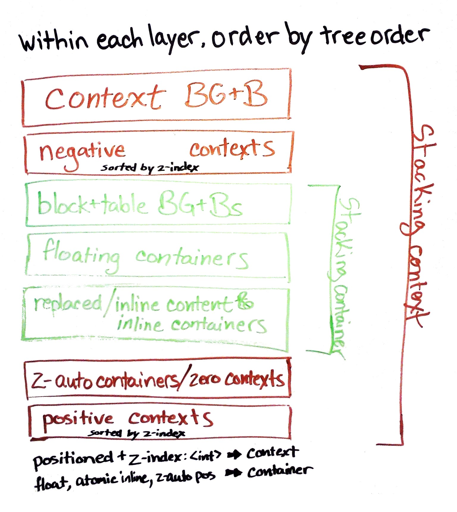

# Flex Item Painting Rules

**Spec:** css3-flexbox | **Owner:** fantasai | **Status:** Closed | **Added:** 2012-07-09 | **Action:** Pick A or B | **Issue:** [http://dev.w3.org/csswg/css3-flexbox/issues-lc-2012](http://dev.w3.org/csswg/css3-flexbox/issues-lc-2012)

#### Background

See [CSS2.1 Appendix E](http://www.w3.org/TR/CSS21/zindex.html)

#### Problem Statement

Do flex items form a pseudo-stacking context (stacking container)?

#### Proposal(s)

Proposal A
: No, they behave like blocks and table cells

Proposal B
: Yes, and they're painted at the same layer as inline blocks.

Other Options
: Yes, and they're painted at [some other] layer.